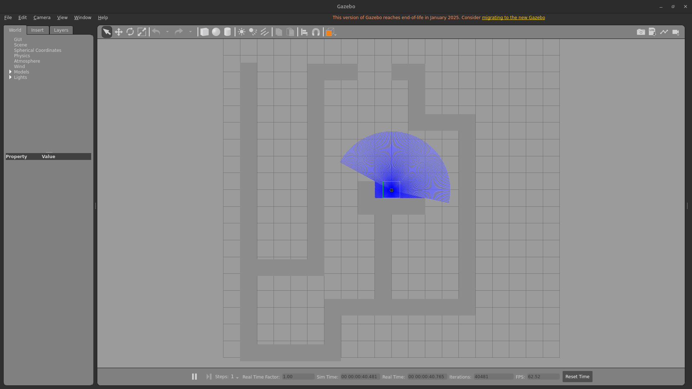

# ROS 2 Reactive Navigation

This project implements a robot navigation system in Gazebo using ROS 2 Humble. It features a robust **Bug2 Algorithm** implementation capable of navigating complex environments defined by custom STL meshes.



## 🚀 Key Features
- **STL Mesh Support**: High-fidelity navigation within complex 3D environments (e.g., `bug_world.stl`).
- **Refined Bug2 Algorithm**:
    - **Side-Tracking**: Reliable M-line intersection detection even at high velocities.
    - **Wall-Side Strategy**: Configurable Left-Hand or Right-Hand wall following.
    - **Progress Guarantee**: Convergence ensured via monotonic distance checks ($d_{leave} < d_{hit}$).
- **Dynamic Configuration**: Fully externalized parameters via YAML for real-time tuning.
- **Navigation Analytics**: Automated summary of distance, time, and arrival accuracy.
- **Dynamic Spawning**: Standards-compliant URDF injection and robot state publishing.

## 📂 Project Structure
```text
HW3/
├── docker-compose.yml                      ← ⭐ Docker
├── Dockerfile
├── README.md                               ← ⭐ README
├── docs/
│   ├── report.pdf                          ← ⭐ Report
│   └── assets/
│       ├── HW3_Video.mp4                   ← ⭐ Video
│       ├── gazebo_isoview.png
│       ├── gazebo_topview.png
│       ├── navigation_summary.png
│       ├── rviz2.png
│       └── world.png
└── src/
    └── reactive_nav/                       ← ⭐ Code
        ├── package.xml
        ├── setup.cfg
        ├── setup.py
        ├── config/
        │   └── parameters.yaml
        ├── launch/
        │   └── bug_behavior.launch.py
        ├── reactive_nav/
        │   ├── __init__.py
        │   ├── autonomous_nav_node.py
        │   └── teleop_node.py
        ├── resource/
        │   └── reactive_nav
        ├── test/
        └── worlds/
            ├── bug_world.world
            └── meshes/
                └── bug_world.stl
```

### ⭐ Highlighted Files
- Video: `docs/assets/bug2_autonav.mp4` for the demonstration
- Code: `src/reactive_nav` is the ROS2 package
- README: `README.md` for instructions
- Report: `docs/report.pdf` containing all technical details
- Docker: `docker-compose.yml` for containerization

## 🛠️ Quick Start

### 1. Environment Setup
```bash
# Allow X11 for Gazebo GUI
xhost +local:docker

# Build and start the container
docker compose up -d --build
```

### 2. Launch Simulation
Access the container and launch the integrated behavior:
```bash
docker compose exec ros_env bash
# Inside the container:
colcon build --packages-select reactive_nav
source install/setup.bash
ros2 launch reactive_nav bug_behavior.launch.py
```

### 3. Interaction

#### 🧭 Autonomous Navigation
1. Open RViz: `ros2 run rviz2 rviz2`.
2. Set a destination using the **2D Nav Goal** tool.
3. Monitor the terminal for the **Navigation Summary** upon arrival.

#### 🎮 Manual Teleoperation
In a separate container terminal:
```bash
ros2 run reactive_nav teleop_node
```
| Input         | Action                       |
| :------------ | :--------------------------- |
| `w` / `x`     | Linear: Forward / Backward   |
| `a` / `d`     | Angular: Left / Right        |
| `s` / `Space` | Force Stop                   |
| `t` / `g`     | Linear Speed Step Up / Down  |
| `y` / `h`     | Angular Speed Step Up / Down |

---

## ⚙️ Configuration
Tweak behavior in `src/reactive_nav/config/parameters.yaml`.

| Parameter         | Default   | Description                                  |
| :---------------- | :-------- | :------------------------------------------- |
| `max_speed`       | `0.22`    | Maximum linear velocity (m/s).               |
| `turning_speed`   | `0.5`     | Angular velocity (rad/s) for rotations.      |
| `safety_dist`     | `0.4`     | Distance (m) to detect and avoid boundaries. |
| `wall_side`       | `"right"` | Wall-following rule (`"left"` or `"right"`). |
| `goal_tolerance`  | `0.01`    | Arrival precision at target coordinates.     |
| `mline_tolerance` | `0.1`     | Sensitivity for M-Line re-intersection.      |
| `progress_delta`  | `0.1`     | Monotonic distance buffer for leaving walls. |

---